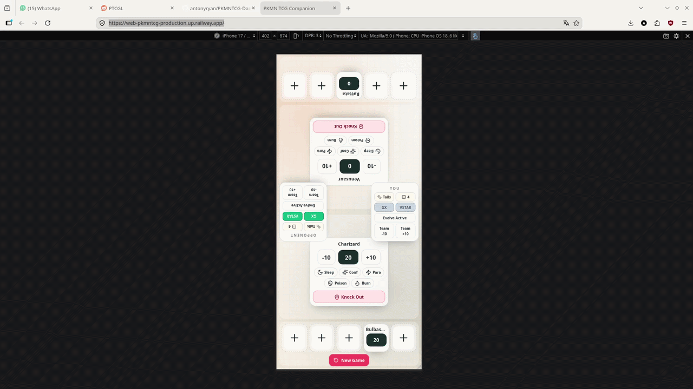

# PKMN TCG Companion

You can check it at: https://web-pkmntcg-production.up.railway.app/

PKMN TCG Companion is a mobile-first web application designed to replace physical match accessories in in-person Pokemon TCG games. The app tracks the active Pokemon, bench slots, damage, special conditions, and once-per-game markers, while also providing quick utilities such as coin flips and die rolls. It is also open source, so feel free to contribute in any way you want.

## Project Structure

- `backend/`: Go + Gin API that owns the Pokemon catalog, evolution validation, match rules, session persistence, and action history.
- `frontend/`: React + Tailwind CSS application focused on a full-screen mobile layout backed by the backend session API.
- `pokemon_data.json`: authoritative Pokemon catalog consumed by the backend.

## What Was Implemented

### Backend

- A modular Gin server with separated files for startup, routing, handlers, catalog loading, game rules, and session storage.
- Catalog search and per-Pokemon evolution-option endpoints backed by the root JSON dataset.
- Session endpoints that create or restore a match, apply validated actions, and expose persisted history.
- Unit tests covering catalog search, full-chain evolution options, and session action validation.

### Frontend

- A mobile-first fixed battlefield split into two halves.
- An inverted opponent field for face-to-face play.
- Reusable Pokemon slot rendering for both active and bench positions.
- Match state management with React Context backed by the backend session API.
- Local persistence limited to the backend `sessionId`, so reloads restore the authoritative server-side snapshot.
- Utilities for coin flips, die rolls, GX markers, VSTAR markers, and full game reset.
- Backend-driven add and evolve flows for active and bench slots.
- Unit tests for the API client helpers.

## Development Notes

### Backend

Run from the `backend/` directory:

```bash
go test .
go test ./...
go test -v ./...
gotestsum --format testname -- -v ./...
go build ./...
go run main.go
```

If `gotestsum` is unavailable, use `go test -v ./...`.

### Frontend

Run from the `frontend/` directory:

```bash
npm install
npm run test -- --run
npm run dev
npm run build
```

## API Quick Reference (curl)

All examples target the default local backend at `http://localhost:8080`.

### Health

```bash
curl http://localhost:8080/health
```

### Pokémon catalog

```bash
# Search by name (returns first 20 by default)
curl "http://localhost:8080/api/pokemon/search?q=char"

# First 5 in National Dex order
curl "http://localhost:8080/api/pokemon/search?limit=5"

# Evolution options for Bulbasaur (id=1)
curl "http://localhost:8080/api/pokemon/1/evolution-options"

# Evolution options filtered by name
curl "http://localhost:8080/api/pokemon/1/evolution-options?q=saur"
```

### Sessions

```bash
# Create a new session
curl -s -X POST http://localhost:8080/api/sessions \
  -H 'Content-Type: application/json' \
  -d '{}'

# Restore an existing session
curl -s -X POST http://localhost:8080/api/sessions \
  -H 'Content-Type: application/json' \
  -d '{"sessionId": "<id>"}'

# Get current state
curl http://localhost:8080/api/sessions/<id>

# Get action history
curl http://localhost:8080/api/sessions/<id>/history
```

### Session actions

```bash
# Place a Pokémon on the active slot (my side)
curl -s -X POST http://localhost:8080/api/sessions/<id>/actions \
  -H 'Content-Type: application/json' \
  -d '{"type":"set-pokemon","side":"me","zone":"active","pokemonId":1}'

# Evolve it to Venusaur
curl -s -X POST http://localhost:8080/api/sessions/<id>/actions \
  -H 'Content-Type: application/json' \
  -d '{"type":"evolve-pokemon","side":"me","zone":"active","pokemonId":3}'

# Add 30 damage to active slot
curl -s -X POST http://localhost:8080/api/sessions/<id>/actions \
  -H 'Content-Type: application/json' \
  -d '{"type":"adjust-damage","side":"me","zone":"active","amount":30}'

# Remove 10 damage (counts as heal if >2 s after last damage)
curl -s -X POST http://localhost:8080/api/sessions/<id>/actions \
  -H 'Content-Type: application/json' \
  -d '{"type":"adjust-damage","side":"me","zone":"active","amount":-10}'

# Toggle poison on active slot
curl -s -X POST http://localhost:8080/api/sessions/<id>/actions \
  -H 'Content-Type: application/json' \
  -d '{"type":"toggle-status","side":"me","status":"poison"}'

# Knockout opponent active slot
curl -s -X POST http://localhost:8080/api/sessions/<id>/actions \
  -H 'Content-Type: application/json' \
  -d '{"type":"knockout","side":"opponent","zone":"active"}'

# Promote bench slot 0 to active (my side)
curl -s -X POST http://localhost:8080/api/sessions/<id>/actions \
  -H 'Content-Type: application/json' \
  -d '{"type":"promote-bench","side":"me","benchIndex":0}'

# Toggle GX marker
curl -s -X POST http://localhost:8080/api/sessions/<id>/actions \
  -H 'Content-Type: application/json' \
  -d '{"type":"toggle-gx","side":"me"}'

# Toggle VSTAR marker
curl -s -X POST http://localhost:8080/api/sessions/<id>/actions \
  -H 'Content-Type: application/json' \
  -d '{"type":"toggle-vstar","side":"me"}'

# Flip a coin
curl -s -X POST http://localhost:8080/api/sessions/<id>/actions \
  -H 'Content-Type: application/json' \
  -d '{"type":"flip-coin"}'

# Roll a die (1-6)
curl -s -X POST http://localhost:8080/api/sessions/<id>/actions \
  -H 'Content-Type: application/json' \
  -d '{"type":"roll-die"}'

# Reset the board
curl -s -X POST http://localhost:8080/api/sessions/<id>/actions \
  -H 'Content-Type: application/json' \
  -d '{"type":"reset"}'
```

### Analytics

```bash
# Top 10 most used Pokémon
curl http://localhost:8080/api/analytics/pokemon-usage

# Custom limit
curl "http://localhost:8080/api/analytics/pokemon-usage?limit=5"

# Total damage dealt and intentionally healed
curl http://localhost:8080/api/analytics/damage

# Total knockouts
curl http://localhost:8080/api/analytics/knockouts
```

## Additional Documentation

- `backend/README.md`: backend architecture, responsibilities, and API behavior.
- `frontend/README.md`: frontend architecture, game state design, and UI behavior.

## Deploy on Railway

This repository is easiest to deploy as two Railway services:

- Backend service from `backend/`
- Frontend service from `frontend/`

Quick sanity check before pushing:

```bash
npm run railway:check
```

To avoid stack auto-detection issues, prefer Dockerfile deploys:

- Backend Dockerfile file in repo: `backend/Dockerfile`
- Frontend Dockerfile file in repo: `frontend/Dockerfile`

With each service root configured (`backend` or `frontend`), set Dockerfile path to `Dockerfile`.

### Backend service settings

- Root directory: `backend`
- Builder: `Dockerfile`
- Dockerfile path: `Dockerfile`

Environment variables:

- `PORT`: provided automatically by Railway
- `CORS_ALLOWED_ORIGIN`: frontend public URL (example: `https://pkmntcg-web.up.railway.app`)
- `DATA_DIR`: optional persistent path (example: `/data`)

Notes:

- The backend now reads `PORT` automatically and falls back to `8080` locally.
- Session files and analytics SQLite database are written under `DATA_DIR` (default: `backend/data`).
- For persistence across restarts, attach a Railway Volume and set `DATA_DIR` to that mount path.

### Frontend service settings

- Root directory: `frontend`
- Builder: `Dockerfile`
- Dockerfile path: `Dockerfile`

Environment variables:

- `VITE_API_BASE_URL`: backend public URL (example: `https://pkmntcg-api.up.railway.app`)

Notes:

- In production, API requests use `VITE_API_BASE_URL`.
- In local dev, requests continue to use relative `/api` paths with the Vite proxy.
